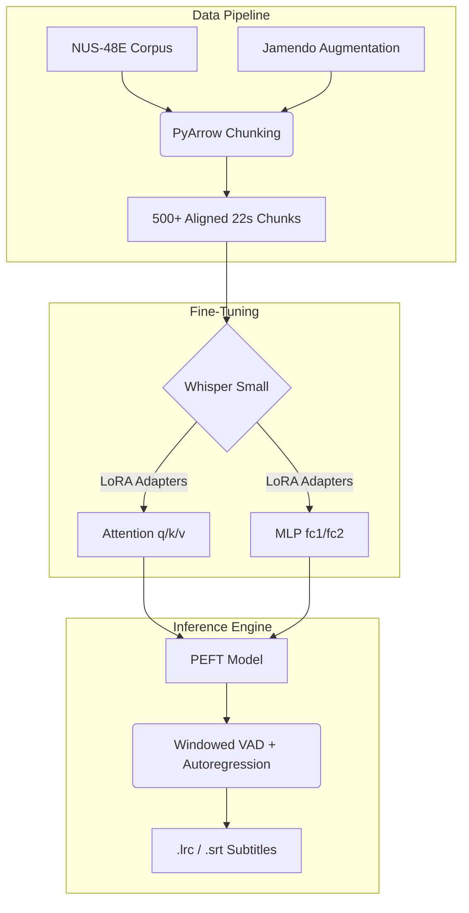

<div align="center">
  <h1>🎤 AutoLyrics</h1>
  <p><b>Domain-Adapted ASR for Sung Vocals & Automated Lyric Alignment</b></p>
  
  
  
  
  
  
</div>

<br/>

> [!NOTE]
> **AutoLyrics** fine-tunes OpenAI Whisper using **LoRA (Low-Rank Adaptation)** to transcribe *sung* vocals, solving the domain collapse seen in off-the-shelf ASR models. It runs full-song inference to produce deterministic, time-aligned `.lrc` and `.srt` lyric files.

---

## 📺 See it in Action

Check out the interactive Gradio web demo, allowing drag-and-drop song transcription and automatic timestamp interpolation!

**[▶️ Watch the AutoLyrics Demo Video](https://drive.google.com/file/d/1UuEqjQFU5i8JaYTTbLc3j-4MX12PD-gM/view)**

<div align="center">
  
  
</div>

---

## 🏗 Architecture & Pipeline

We utilize a parameter-efficient pipeline that injects adapters into the Whisper encoder/decoder without retraining all 244M+ base weights.



---

## 🚀 Performance Metrics

Off-the-shelf Whisper struggles with melisma, vibrato, and holding vowels. Our fine-tuning strategy strictly focuses on these sung-vocal domains.

| Model Pipeline | Dataset | Evaluation Metric | Result |
|----------------|---------|-------------------|--------|
| **Whisper-tiny** (Untuned Baseline) | NUS-48E (Test) | Word Error Rate (WER) | 0.1872 |
| **Whisper-tiny** (LoRA 25 Epochs) | NUS-48E (Test) | Word Error Rate (WER) | 0.1771 |
| **Whisper-small** (v3 Pipeline) | NUS-48E + Jamendo | Relative WER Reduction | 🎯 **>15% (Target)** |

> [!TIP]
> We are actively training the `whisper-small` checkpoint across 50 epochs utilizing `r=16` and `α=32` to aggressively push past the 15% WER reduction threshold.

---

## 💻 Installation

Requires **Python ≥ 3.10** and a **CUDA-capable GPU** for training. We heavily utilize `bitsandbytes` 4-bit quantization.

```bash
git clone https://github.com/DeVshaurya01/AutoLyrics.git
cd AutoLyrics

make install
# or run: pip install -e . -r requirements.txt
```

> [!WARNING]
> **Flash Attention Note:** The pinned PyTorch wheels on Windows do not natively include Flash Attention. The model elegantly falls back to `scaled_dot_product_attention`—it remains fully functional, just slightly slower.

---

## 🛠 Standard Usage (v3 Pipeline)

We've automated the data ingestion, fine-tuning, and inference workloads via dedicated scripts.

```bash
# 1. Fetch Jamendo augmentation data (saves 500+ chunks)
python scripts/fetch_jamendo.py

# 2. Prepare the v3 dataset (NUS-48E + Jamendo interpolation)
python scripts/prepare_data_v3.py

# 3. Train the LoRA adapter (50 epochs, r=16, alpha=32)
python scripts/train.py

# 4. Evaluate against the matched-distribution test set
python scripts/evaluate_v3.py

# 5. Launch the Web Interface
python app.py
```

<details>
<summary><b>Single-Song CLI Inference</b></summary>

```bash
# Run a full song through the trained adapter to output raw .lrc
python scripts/align.py --audio path/to/song.wav --adapter outputs/checkpoints/final_adapter --out song.lrc
```
</details>

---

## 📂 Project Layout

```text
AutoLyrics/
├── assets/                  # UI screenshots and banners
├── docs/                    # Architectural blueprints and build logs
├── scripts/                 # CLI entrypoints (fetch, prepare, train, evaluate)
├── configs/                 # Hydra config trees (model, lora, data)
├── data/                    # Datasets (raw, interim, processed/hf_dataset)
├── src/autolyrics/          # Core library (inference, evaluation, models)
├── outputs/                 # Checkpoints, tensorboard logs, and reports
├── app.py                   # Gradio Web Interface
└── Makefile                 # Build shortcuts
```
