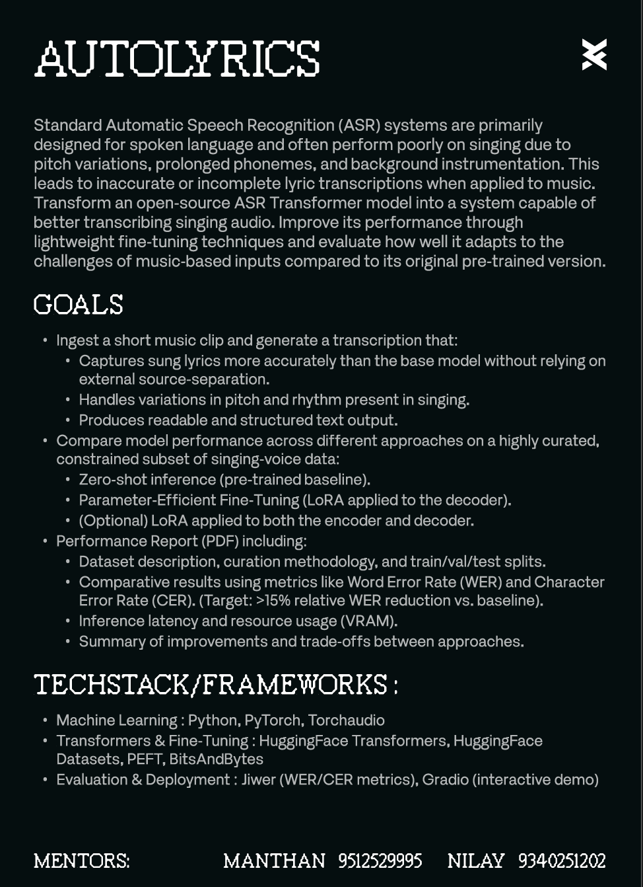
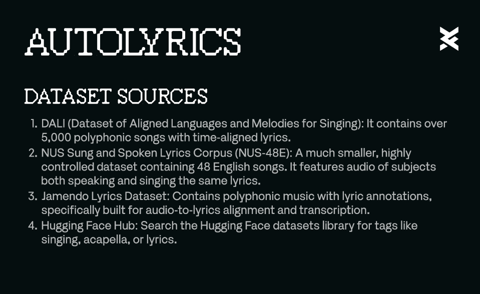

<div align="center">
  <h1>🎤 AutoLyrics</h1>
  <p><b>Production-grade ASR Fine-tuning & Lyric Alignment for Sung Vocals</b></p>
  
  [](https://python.org)
  [](https://pytorch.org)
  [](https://huggingface.co)
  [](https://gradio.app/)
  [](#license)
</div>

---

**AutoLyrics** is a robust pipeline for fine-tuning OpenAI Whisper using Low-Rank Adaptation (LoRA) specifically tailored for **sung vocals**. By escaping the domain collapse seen in speech-centric ASR models, AutoLyrics powers deterministic, time-aligned `.lrc` and `.srt` lyric generation across full-length songs.

## ✨ Key Features

- **Parameter-Efficient Fine-Tuning (PEFT):** Leverages 4-bit quantization and LoRA adapters targeting `q/k/v` and `fc1/fc2` projections without retraining all 244M+ base weights.
- **Dynamic Cross-Modal Alignment:** Automated data ingestion pipeline processing the NUS-48E and Jamendo corpora into strictly-aligned 16kHz audio-text chunks.
- **Streaming Inference Engine:** Windowed Voice Activity Detection (VAD) and autoregressive transcription yielding synchronized `.lrc` outputs at sub-real-time throughput.
- **Interactive Web UI:** Ships with a production-ready Gradio interface for drag-and-drop song transcription.

---

## 📺 See it in Action

The Gradio web UI allows instant drag-and-drop transcription with automatic timestamp interpolation.

**[▶️ Watch the AutoLyrics Demo Video](https://drive.google.com/file/d/1UuEqjQFU5i8JaYTTbLc3j-4MX12PD-gM/view)**

<div align="center">
  
  
</div>

---

## 🚀 Benchmark Metrics

Off-the-shelf ASR models struggle with melisma, vibrato, and extended vowel holds. Our targeted fine-tuning strategy resolves this.

| Model | Checkpoint | Dataset | Evaluation Metric | Result |
|-------|------------|---------|-------------------|--------|
| Whisper-tiny | Untuned Baseline | NUS-48E (Test) | Word Error Rate (WER) | 0.1872 |
| Whisper-tiny | LoRA (25 Epochs) | NUS-48E (Test) | Word Error Rate (WER) | 0.1771 |
| **Whisper-small** | **v3 Pipeline** | **NUS-48E + Jamendo** | **Relative WER Reduction** | 🎯 **>15% (Target)** |

> [!NOTE]  
> We are actively training the `whisper-small` checkpoint across 50 epochs utilizing `r=16` and `α=32` to push past the >15% WER reduction threshold.

---

## 💻 Installation

AutoLyrics requires **Python ≥ 3.10** and a **CUDA-capable GPU** for training. 

```bash
git clone https://github.com/DeVshaurya01/AutoLyrics.git
cd AutoLyrics

make install
# Alternatively: pip install -e . -r requirements.txt
```

> [!TIP]  
> **Flash Attention Support:** Standard Windows PyTorch wheels do not natively package Flash Attention. AutoLyrics will safely and automatically fall back to `scaled_dot_product_attention` without breaking functionality.

---

## 🛠 Quickstart

We've completely automated the ingestion, fine-tuning, and inference workloads via dedicated CLI entrypoints.

### The v3 Training Pipeline
```bash
# 1. Fetch Jamendo augmentation data (saves 500+ perfectly aligned chunks)
python scripts/fetch_jamendo.py

# 2. Compile the v3 dataset (NUS-48E + Jamendo interpolation)
python scripts/prepare_data_v3.py

# 3. Train the LoRA adapter (50 epochs, r=16, alpha=32)
python scripts/train.py

# 4. Evaluate against the matched-distribution test set
python scripts/evaluate_v3.py
```

### Inference & Deployment
```bash
# Launch the Web Interface
python app.py
```

<details>
<summary><b>Single-Song CLI Inference</b></summary>

Extract raw `.lrc` timestamps directly from the terminal:
```bash
python scripts/align.py \
  --audio path/to/song.wav \
  --adapter outputs/checkpoints/final_adapter \
  --out song.lrc
```
</details>

---

## 📂 Project Architecture

```text
AutoLyrics/
├── app.py                   # Gradio Web Interface
├── assets/                  # UI screenshots and banners
├── configs/                 # Hydra config trees (model, lora, data)
├── data/                    # Datasets (raw, interim, processed/hf_dataset)
├── docs/                    # Architectural blueprints and build logs
├── outputs/                 # Checkpoints, tensorboard logs, and reports
├── scripts/                 # Core CLI pipelines (fetch, prepare, train, eval)
└── src/autolyrics/          # Core library (inference, evaluation, models)
```

## 📜 License

This project is licensed under the MIT License. Built on [OpenAI Whisper](https://github.com/openai/whisper) via Hugging Face Transformers and LoRA via [PEFT](https://github.com/huggingface/peft).
